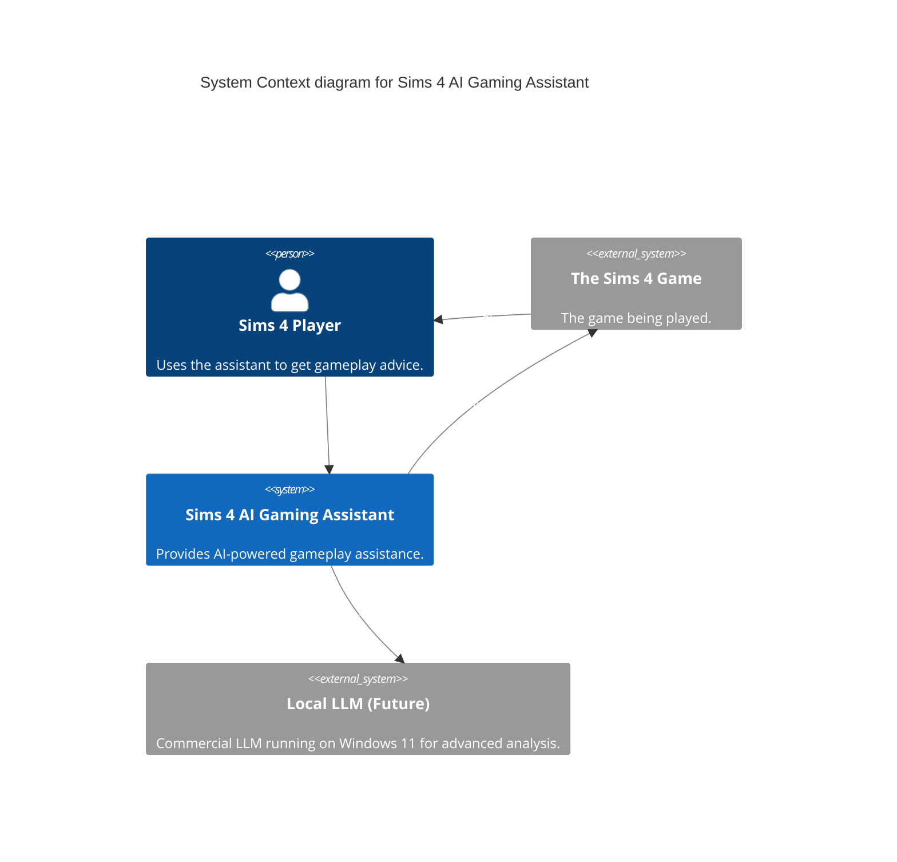

```mermaid
C4Context
    title System Context diagram for Sims 4 AI Gaming Assistant

    Person(user, "Sims 4 Player", "Uses the assistant to get gameplay advice.")
    System_Ext(sims4, "The Sims 4 Game", "The game being played.")
    System(sims_ai_assistant, "Sims 4 AI Gaming Assistant", "Provides AI-powered gameplay assistance.")
    System_Ext(local_llm, "Local LLM (Future)", "Commercial LLM running on Windows 11 for advanced analysis.")

    Rel(user, sims_ai_assistant, "Uses")
    Rel(sims_ai_assistant, sims4, "Observes (via Screenshot)")
    Rel_Back(user, sims4, "Plays")
    Rel(sims_ai_assistant, local_llm, "Sends data for analysis (Future)", "Image, Text")

    UpdateRelStyle(user, sims_ai_assistant, $textColor="white", $lineColor="gray", $offsetX="-40")
    UpdateRelStyle(sims_ai_assistant, sims4, $textColor="white", $lineColor="gray", $offsetX="-40")
    UpdateRelStyle(user, sims4, $textColor="white", $lineColor="gray", $offsetX="0")
    UpdateRelStyle(sims_ai_assistant, local_llm, $textColor="white", $lineColor="gray", $offsetX="-40")
```
