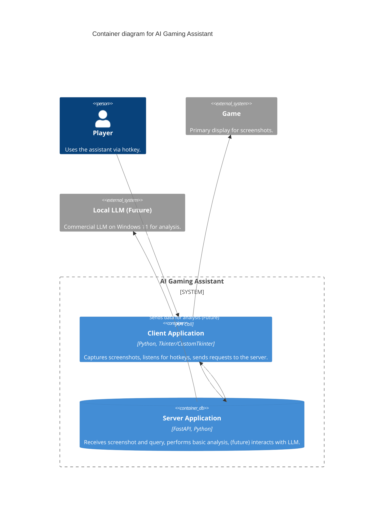

```mermaid
C4Container
    title Container diagram for AI Gaming Assistant

    Person(user, "Player", "Uses the assistant via hotkey.")
    System_Ext(game, "Game", "Primary display for screenshots.")
    System_Ext(local_llm, "Local LLM (Future)", "Commercial LLM on Windows 11 for analysis.")

    System_Boundary(assistant_boundary, "AI Gaming Assistant") {
        Container(client_app, "Client Application", "Python, Tkinter/CustomTkinter", "Captures screenshots, listens for hotkeys, sends requests to the server.")
        ContainerDb(server_app, "Server Application", "FastAPI, Python", "Receives screenshot and query, performs basic analysis, (future) interacts with LLM.")
    }

    Rel(user, client_app, "Triggers (Ctrl+Shift+I)")
    Rel(client_app, game, "Captures Screenshot from", "OS API")
    Rel(client_app, server_app, "Sends Screenshot & Query", "HTTP/S (multipart/form-data)")
    Rel(server_app, client_app, "Returns Analysis Result", "JSON")
    Rel(server_app, local_llm, "Sends data for analysis (Future)", "API Call")

    UpdateRelStyle(user, client_app, $textColor="white", $lineColor="gray", $offsetX="-40")
    UpdateRelStyle(client_app, game, $textColor="white", $lineColor="gray", $offsetY="10")
    UpdateRelStyle(client_app, server_app, $textColor="white", $lineColor="gray", $offsetX="-60")
    UpdateRelStyle(server_app, client_app, $textColor="white", $lineColor="gray", $offsetY="-40", $offsetX="-60")
    UpdateRelStyle(server_app, local_llm, $textColor="white", $lineColor="gray", $offsetX="-40")
```
