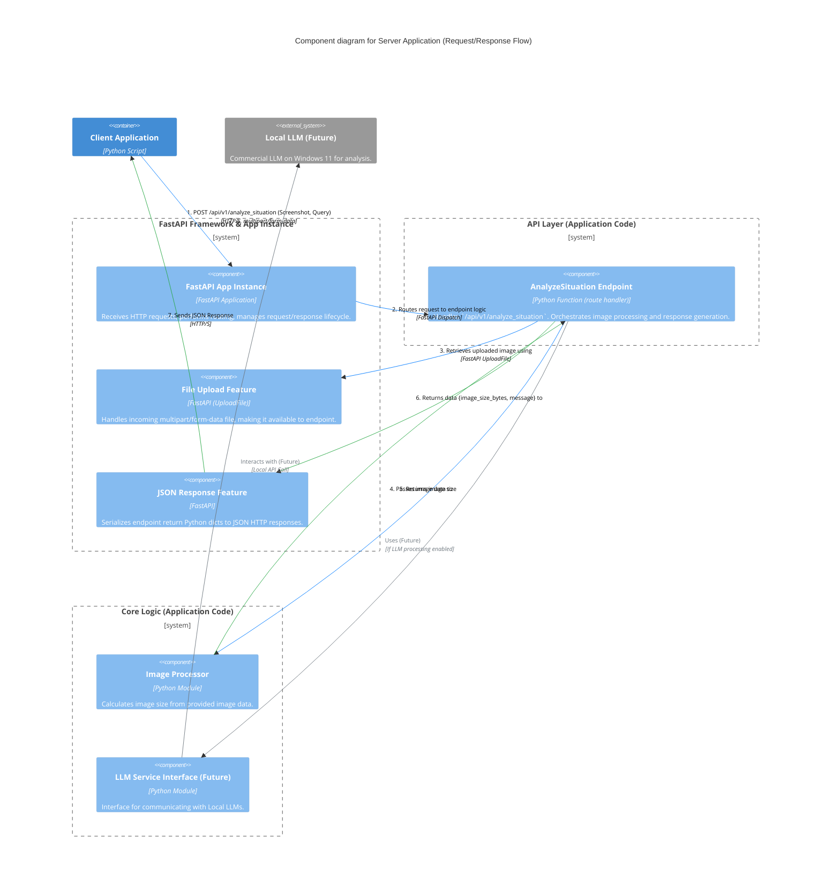

```mermaid
C4Component
    title Component diagram for Server Application (Request/Response Flow)

    Container(client_app, "Client Application", "Python Script")
    System_Ext(local_llm, "Local LLM (Future)", "Commercial LLM on Windows 11 for analysis.")

    Boundary(fastapi_boundary, "FastAPI Framework & App Instance") {
        Component(fastapi_app, "FastAPI App Instance", "FastAPI Application", "Receives HTTP requests, performs routing, manages request/response lifecycle.")
        Component(file_upload_feature, "File Upload Feature", "FastAPI (UploadFile)", "Handles incoming multipart/form-data file, making it available to endpoint.")
        Component(json_response_feature, "JSON Response Feature", "FastAPI", "Serializes endpoint return Python dicts to JSON HTTP responses.")
    }

    Boundary(api_layer, "API Layer (Application Code)") {
        Component(analyze_endpoint, "AnalyzeSituation Endpoint", "Python Function (route handler)", "Handles `/api/v1/analyze_situation`. Orchestrates image processing and response generation.")
    }

    Boundary(core_logic, "Core Logic (Application Code)") {
        Component(image_processor, "Image Processor", "Python Module", "Calculates image size from provided image data.")
        Component(llm_service_interface, "LLM Service Interface (Future)", "Python Module", "Interface for communicating with Local LLMs.")
    }

    Rel(client_app, fastapi_app, "1. POST /api/v1/analyze_situation (Screenshot, Query)", "HTTP/S, multipart/form-data")
    Rel(fastapi_app, analyze_endpoint, "2. Routes request to endpoint logic", "FastAPI Dispatch")
    Rel(analyze_endpoint, file_upload_feature, "3. Retrieves uploaded image using", "FastAPI UploadFile")
    Rel(analyze_endpoint, image_processor, "4. Passes image data to")

    Rel(image_processor, analyze_endpoint, "5. Returns image size")
    Rel(analyze_endpoint, json_response_feature, "6. Returns data {image_size_bytes, message} to")
    Rel(json_response_feature, client_app, "7. Sends JSON Response", "HTTP/S")

    Rel(analyze_endpoint, llm_service_interface, "Uses (Future)", "If LLM processing enabled")
    Rel(llm_service_interface, local_llm, "Interacts with (Future)", "Local API Call")

    UpdateRelStyle(client_app, fastapi_app, $textColor="black", $lineColor="#007bff", $lineStyle="solid")
    UpdateRelStyle(fastapi_app, analyze_endpoint, $textColor="black", $lineColor="#007bff", $lineStyle="solid")
    UpdateRelStyle(analyze_endpoint, file_upload_feature, $textColor="black", $lineColor="#007bff", $lineStyle="solid")
    UpdateRelStyle(analyze_endpoint, image_processor, $textColor="black", $lineColor="#007bff", $lineStyle="solid")

    UpdateRelStyle(image_processor, analyze_endpoint, $textColor="black", $lineColor="#28a745", $lineStyle="solid", $offsetX="20", $offsetY="20")
    UpdateRelStyle(analyze_endpoint, json_response_feature, $textColor="black", $lineColor="#28a745", $lineStyle="solid")
    UpdateRelStyle(json_response_feature, client_app, $textColor="black", $lineColor="#28a745", $lineStyle="solid")

    UpdateRelStyle(analyze_endpoint, llm_service_interface, $textColor="#6c757d", $lineColor="#6c757d", $lineStyle="dashed")
    UpdateRelStyle(llm_service_interface, local_llm, $textColor="#6c757d", $lineColor="#6c757d", $lineStyle="dashed")
```
