# Local AI Services Architecture

## Overview

This diagram illustrates the integration of local Text-to-Speech (TTS) and Image Recognition services into the AI Gaming Assistant. The integration was implemented on branch `codex/integrate-local-tts-and-image-recognition` to provide offline AI capabilities.

## Architecture Diagram

```mermaid
graph TB
    %% User Interface Layer
    Client[🖥️ Windows Client App]
    
    %% API Gateway
    FastAPI[🚀 FastAPI Server<br/>localhost:8000]
    
    %% New Services Added
    subgraph "🆕 Local AI Services"
        TTS[🔊 TTS Service<br/>Coqui XTTS-v2<br/>Multilingual]
        ImageAnalysis[👁️ Image Analysis Service<br/>VIT-GPT2<br/>HuggingFace]
    end
    
    %% API Endpoints
    subgraph "🆕 New API Endpoints"
        TTSEndpoint["/api/v1/tts/speak"]
        ImageEndpoint["/api/v1/image/analyze"]
        CombinedEndpoint["/api/v1/game/analyze-and-speak"]
    end
    
    %% Existing Services
    subgraph "Existing Services"
        AnalyzeEndpoint["/api/v1/analyze_situation"]
        Database[(SQLite Database)]
    end
    
    %% External Dependencies
    subgraph "🆕 AI Models"
        XTTSModel[XTTS-v2 Model<br/>Multilingual TTS]
        VITModel[VIT-GPT2 Model<br/>Image Captioning]
    end
    
    %% Data Flow
    Client -->|Screenshot + Text| FastAPI
    FastAPI --> TTSEndpoint
    FastAPI --> ImageEndpoint
    FastAPI --> CombinedEndpoint
    FastAPI --> AnalyzeEndpoint
    
    TTSEndpoint --> TTS
    ImageEndpoint --> ImageAnalysis
    CombinedEndpoint --> ImageAnalysis
    CombinedEndpoint --> TTS
    
    TTS --> XTTSModel
    ImageAnalysis --> VITModel
    
    %% Output Flow
    TTS -->|WAV Audio| FastAPI
    ImageAnalysis -->|Text Description| FastAPI
    FastAPI -->|Audio/Text Response| Client
    
    %% Data Storage
    FastAPI --> Database
    
    %% Styling
    classDef newService fill:#e1f5fe,stroke:#01579b,stroke-width:2px
    classDef newEndpoint fill:#f3e5f5,stroke:#4a148c,stroke-width:2px
    classDef aiModel fill:#fff3e0,stroke:#e65100,stroke-width:2px
    
    class TTS,ImageAnalysis newService
    class TTSEndpoint,ImageEndpoint,CombinedEndpoint newEndpoint
    class XTTSModel,VITModel aiModel
```

## Key Components

### Local AI Services
- **TTS Service**: Coqui XTTS-v2 for multilingual text-to-speech conversion
- **Image Analysis Service**: VIT-GPT2 model for screenshot captioning

### New API Endpoints
- `/api/v1/tts/speak` - Convert text to speech audio
- `/api/v1/image/analyze` - Generate descriptions from uploaded images
- `/api/v1/game/analyze-and-speak` - Combined pipeline: image → description → audio

### Benefits
- **Offline Processing**: Reduces dependency on external APIs
- **Lower Latency**: Local processing for faster responses
- **Cost Efficiency**: No per-request API charges
- **Privacy**: Screenshot data remains local

## Technical Implementation

### Models Used
- **XTTS-v2**: Multilingual TTS supporting English, Russian, German, and others
- **VIT-GPT2**: Vision Transformer with GPT-2 for image captioning

### GPU Acceleration
Both services support GPU acceleration when CUDA is available, with graceful fallback to CPU processing.

**Performance Benefits:**
- **TTS Generation**: 10-20x faster with GPU (1-3 seconds vs 15-30 seconds)
- **VRAM Usage**: 2-4GB for XTTS-v2 model
- **Recommended**: RTX 4070 Super (12GB) or better for optimal performance

**Setup:** See [CUDA Setup Guide](cuda-setup-guide.md) for detailed installation instructions.

**Verification:** Run `python scripts/verify_cuda.py` to test your GPU setup. 